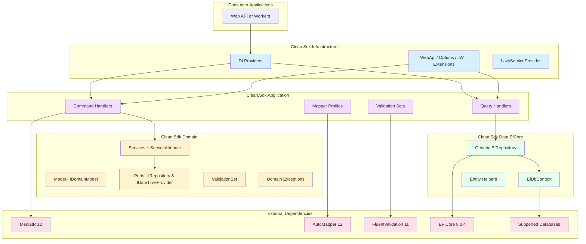
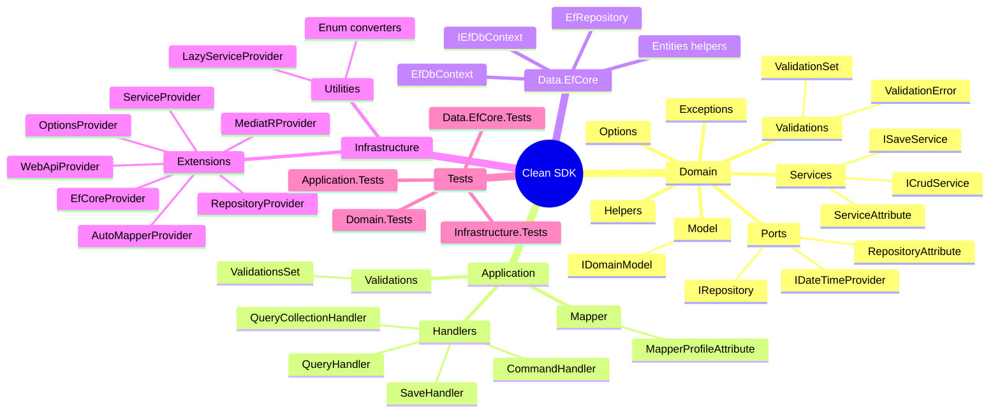
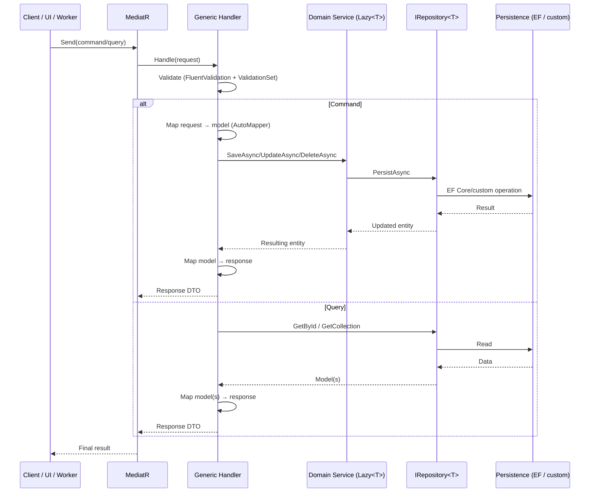

# System Architecture - Main GPS

This document is the architectural **GPS** for Clean SDK: a set of .NET 8 packages that encapsulate clean/hexagonal architecture patterns to accelerate enterprise application development.

## 🎯 System Overview

### Main Purpose

Clean SDK provides a **core set of reusable building blocks** for Clean Architecture and CQRS-based solutions:

- Defines domain contracts (`IDomainModel`, `IRepository`, generic services) and cross-cutting utilities.
- Provides generic command/query handlers with MediatR + AutoMapper + FluentValidation.
- Includes an optional persistence implementation with Entity Framework Core 8.
- Centralizes bootstrapping and integration through infrastructure extensions for DI, options, authentication, and data providers.

### Ecosystem Distribution

- **Production packages**: 4 (`Clean.Sdk.Domain`, `Clean.Sdk.Application`, `Clean.Sdk.Data.EfCore`, `Clean.Sdk.Infrastructure`).
- **Test packages**: 4 (`*.Tests`) aligned with each layer.
- **Target stack**: `.NET 8` for all libraries and test suites.
- **Critical packages**:
  1. `Clean.Sdk.Domain` – mandatory core and dependency convergence point.
  2. `Clean.Sdk.Application` – CQRS layer orchestrating domain services and repositories.
  3. `Clean.Sdk.Data.EfCore` – EF Core 8 repository adapter (installed only when EF is needed).
  4. `Clean.Sdk.Infrastructure` – composition root: DI providers, authentication, data providers, and utilities.

### High-Level Architecture Diagram



*Assumption: because there are no explicit references to external SaaS integrations inside Clean.Sdk, only NuGet and database-provider interactions are documented here. Update this section when formal external providers are introduced in consuming solutions.*

## 🗂️ Layer and Package Map

### Clean.Sdk.Domain – Domain Core

- **Role**: Encapsulates framework-independent contracts, services, and cross-cutting utilities.
- **Target**: `net8.0`.
- **NuGet dependencies**: `Microsoft.Extensions.Logging.Abstractions` 8.0.0.
- **Notable structure**:
  - `Model/IDomainModel.cs`: common contract for strongly typed models with `Id`.
  - `Ports/`: `IRepository<TModel>`, `IDateTimeProvider`, `RepositoryAttribute`.
  - `Services/`: generic services (`ISaveService`, `IDeleteService`, `IUpdateService`, `ICrudService`) and base classes (`Service`, `CrudService`). The `[Service]` attribute enables auto-discovery.
  - `Exceptions/`: hierarchy (`AppExeption`, `ValidationException`, `NotAuthorizeException`, etc.).
  - `Validations/`: `ValidationSet`, argument extensions, and related exceptions.
  - `Helpers/`: reflection utilities (`AssemblyHelper`, `InterfaceHelper`), hashing, enums.
  - `Options/`: configuration mapping (`AppSettings`, `AuthOptions`, `OptionAttribute`).

### Clean.Sdk.Application – CQRS Layer

- **Role**: Provides generic command/query/update handlers built on MediatR.
- **Target**: `net8.0`.
- **Dependencies**: `MediatR` 12.1.1, `AutoMapper` 12.0.1, `FluentValidation` 11.9.0, `Microsoft.Extensions.DependencyInjection.Abstractions` 8.0.0.
- **Key components**:
  - `Handlers/`:
    - `Handler` → common base.
    - `CommandHandler<TService>` and `QueryHandler<TRepository>` → lazy dependency handling (`Lazy<T>`).
    - `SaveHandler`, `UpdateHandler`, `CommandDeleteByIdHandler`, `QueryByIdHandler`, `QueryCollectionHandler` → generic implementations with `IMapper` and validations.
    - `AplicacionHandlerAttribute` interface/attribute for conventions.
  - `Validations/ValidationsSet.cs`: ruleset convention (`ValidationsSet.SAVE`, `UPDATE`, etc.).
  - `Mapper/MapperProfileAttribute.cs`: attribute for automatic AutoMapper profile discovery.

### Clean.Sdk.Data.EfCore – Optional Persistence

- **Role**: Adapts `IRepository<TModel>` to Entity Framework Core 8.
- **Target**: `net8.0`.
- **Dependencies**: `Microsoft.EntityFrameworkCore` 8.0.4, `Microsoft.EntityFrameworkCore.Relational` 8.0.4, `AutoMapper` 12.0.1.
- **Structure**:
  - `EfRepository<TEntity, TContext>`: generic CRUD with expression support, relationship loading, and basic pagination.
  - `EfDbContext` / `IEfDbContext`: base context contract (injectable by consumers).
  - `Entities/`: entity helpers (`IDomainEntity`, `IAuditableEntity`, `EntityHelper`).
- **Configurations**: in `Debug`, references Domain project for local development; in `Prerelease/Release`, expects `Clean.Sdk.Domain` packages from a NuGet feed.

### Clean.Sdk.Infrastructure – Bootstrapping & Integration

- **Role**: Centralizes extensions for registering SDK services into consuming applications.
- **Target**: `net8.0`.
- **Dependencies** (selection):
  - `AutoMapper.Extensions.Microsoft.DependencyInjection` 12.0.1.
  - `Microsoft.AspNetCore.Authentication.JwtBearer` 8.0.0.
  - EF Core 8.0.4 providers for SQL Server, InMemory, PostgreSQL, and `MySql.EntityFrameworkCore` 8.0.0.
  - `Microsoft.Extensions.Configuration.*` 8.0.0.
- **Main extensions** (`Extensions/`):
  - `ServiceProvider`: registers classes with `[Service]` and matching `I{Name}` interface; throws `AppExeption` when interface is missing.
  - `RepositoryProvider`: same convention for `[Repository]`.
  - `MediatRProvider`, `AutoMapperProvider`, `EfCoreProvider`, `OptionsProvider`, `WebApiProvider`, `LazyProvider`.
- **Utilities**: `LazyServiceProvider` for deferred injection, enum converters (`Utilities/`).

### Package Overview Visualization



## ⚙️ Global Technology Stack

- **Language**: C# 12 on .NET 8.
- **Frameworks/Libraries**: MediatR 12.1.1, AutoMapper 12.0.1, FluentValidation 11.9.0, EF Core 8.0.4, JwtBearer 8.0.0.
- **Supported persistence**: SQL Server, PostgreSQL, MySQL, InMemory (via EF Core providers 8); other strategies via custom `IRepository` implementations.
- **Build tooling**: `dotnet` (MSBuild), YAML CI/CD pipelines (`Clean.Sdk-CI.yml`, `Clean.Sdk.*-CD.yml`).
- **Testing**: xUnit 2.6.3, Moq 4.20.70, `coverlet.collector` 6.0.0, `Microsoft.NET.Test.Sdk` 17.10.0.
- **Note**: `.csproj` metadata (`Title`/`Description`) still contains “Clean Data EfCore” values and should be aligned in a later cycle.

### Implemented Architecture Patterns

1. **Clean/hexagonal architecture**: dependencies point inward to domain abstractions (ports/adapters).
2. **CQRS**: explicit command/query separation, generic handlers, Mediator pattern (MediatR) as core orchestration.
3. **Repository pattern**: `IRepository<TModel>` as port; concrete adapters via EF Core or other ORMs.
4. **Inversion of control**: convention-based DI registration for services, repositories, options, AutoMapper, and MediatR.
5. **Declarative validations**: FluentValidation + `ValidationsSet` to orchestrate rules by operation scenario.
6. **Domain-driven building blocks**: domain-centered exceptions, helpers, services, and configuration options.

## 🔗 Internal Integration Points

```
┌────────────────────────────┐
│ Clean.Sdk.Infrastructure   │
│ (registration & providers) │
└─────────────┬──────────────┘
              │
    ┌─────────▼─────────┐
    │ Clean.Sdk.Application │────────┐
    └─────────┬─────────┘        │
              │                   │
      ┌───────▼───────┐      ┌────▼────┐
      │ Clean.Sdk.Domain │◀────│ Clean.Sdk.Data.EfCore │
      └────────────────┘      └────────┘
```

- `Clean.Sdk.Domain` does not depend on other SDK projects.
- `Clean.Sdk.Application` and `Clean.Sdk.Data.EfCore` depend on Domain.
- `Clean.Sdk.Infrastructure` depends on Domain + Application and, in Debug mode, also on Data.EfCore (for no-package scenarios).
- `*.Tests` projects reference their production counterpart and use `Microsoft.EntityFrameworkCore.InMemory` where applicable.

### External Library Integrations

| Library / Service | Version | Usage | Purpose |
| --- | --- | --- | --- |
| MediatR | 12.1.1 | Application/Infrastructure | CQRS mediator pattern |
| AutoMapper | 12.0.1 | Application/Infrastructure | DTO ↔ model mapping |
| FluentValidation | 11.9.0 | Application | Declarative validation rules |
| Microsoft.Extensions.* | 8.0.0 | All layers | Logging, configuration, DI |
| EF Core | 8.0.4 | Data.EfCore/Infrastructure | Relational persistence |
| JwtBearer | 8.0.0 | Infrastructure | Optional JWT authentication |
| `MySql.EntityFrameworkCore` | 8.0.0 | Infrastructure | MySQL provider |
| `Npgsql.EntityFrameworkCore.PostgreSQL` | 8.0.4 | Infrastructure | PostgreSQL provider |
| `Microsoft.EntityFrameworkCore.InMemory` | 8.0.4 | Infrastructure/Tests | Repository tests |

No direct integrations with external services (Auth0, Stripe, etc.) were identified inside the SDK; consuming applications should document those links.

### Typical Data Flow



## 🔐 Integration and Security Patterns

- **Automatic discovery**:
  - `AddDomainServices(assembly)` registers classes with `[Service]` and `I{Name}` interface; without interface it throws `AppExeption` with localized message (`Messages.ServiceHasNoInterface`).
  - `AddRepositories(assembly)` applies the same convention for `[Repository]`.
  - `AddMediatR`, `AddAutoMapper`, and validator scanning provide bootstrap without manual wiring.
- **Authentication**: `WebApiProvider` includes base JWT Bearer 8.0.0 setup (must be completed by host application).
- **Validations**: `ValidationsSet` supports operation-specific rule segmentation (`SAVE`, `UPDATE`, `DELETE`). Validation failures throw `ValidationSetException` with details.
- **Errors**: custom domain exceptions provide failure differentiation (invalid argument, unauthorized, not found, null, etc.).

## 🧪 Testing Reality

- **Clean.Sdk.Domain.Tests** (`net8.0`): validations, helpers, services; includes `.resx` resources for messages.
- **Clean.Sdk.Application.Tests**: handler unit tests using Moq; references `Clean.Sdk.Domain.Tests` for reusable builders.
- **Clean.Sdk.Data.EfCore.Tests**: EF Core 8 InMemory scenarios to validate `EfRepository`.
- **Clean.Sdk.Infrastructure.Tests**: provider and DI registration verification.

| Tool | Version | Usage |
| --- | --- | --- |
| xUnit | 2.6.3 | Testing framework |
| Moq | 4.20.70 | Mocking |
| coverlet.collector | 6.0.0 | Coverage |
| Microsoft.NET.Test.Sdk | 17.10.0 | Test infrastructure |

### Useful Commands

```powershell
# Restore dependencies
dotnet restore Clean.Skd.sln

# Full build (Debug by default)
dotnet build Clean.Skd.sln

# Run all tests
dotnet test Clean.Skd.sln

# Run tests with coverage
dotnet test Clean.Skd.sln /p:CollectCoverage=true

# Package (Release)
dotnet pack Clean.Sdk.Domain/Clean.Sdk.Domain.csproj -c Release
```

> Note: solution name is `Clean.Skd.sln` (inherited typo). Consider renaming it to `Clean.Sdk.sln` for consistency.

## ⚠️ Observations and Technical Debt

- **Inconsistent metadata**: Domain, Application, and Data.EfCore `.csproj` files still use inherited “Clean Data EfCore” title/description values; adjust to reflect each layer.
- **Naming typos in files**: `Clean.Skd.sln` and `Clean.Sdk.Generci-CD.yml` include naming errors. Renaming requires coordinated pipeline/solution updates.
- **Minimal root documentation**: root `README.md` was historically sparse; keep it expanded and synchronized.
- **EF Core optionality**: `Clean.Sdk.Infrastructure` references `Clean.Sdk.Data.EfCore` in Debug mode, which may surprise users who intend to exclude EF. Document this expectation (or decouple in code).
- **Missing cross-repo guide**: this GPS covers only Clean.Sdk. Host applications should document how they consume the SDK, handle external auth, messaging, and CI/CD.

## 📦 Dependencies and Risk

| Dependency | Current Version | Latest Version | Risk | Comment |
| --- | --- | --- | --- | --- |
| .NET SDK | 8.0.x | 8.0.x | 🟢 Low | Up to date |
| MediatR | 12.1.1 | 12.x | 🟢 Low | Current stable branch |
| AutoMapper | 12.0.1 | 13.x preview | 🟢 Low | Supported stable version |
| FluentValidation | 11.9.0 | 11.9.x | 🟢 Low | Current |
| EF Core | 8.0.4 | 8.0.x | 🟢 Low | Latest LTS patch |
| JwtBearer | 8.0.0 | 8.0.x | 🟡 Medium | Review recent security patches |
| xUnit | 2.6.3 | 2.6.4 | 🟢 Low | Updatable without breaking changes |
| coverlet.collector | 6.0.0 | 6.0.x | 🟢 Low | Latest major |

No dependencies with known open CVEs were identified in pinned versions. Keep continuous monitoring.

## 🔧 Quick Development Guide

1. Restore and build using `dotnet restore` / `dotnet build` on `.NET 8`.
2. Run unit tests (`dotnet test`) with optional coverage.
3. Package individual layers (`dotnet pack`) per configuration (`Debug`, `Prerelease`, `Release`).
4. Publish to NuGet feed through pipelines (`Clean.Sdk.*-CD.yml`).
5. From an external application, install required packages (`Clean.Sdk.Domain`, `Clean.Sdk.Application`, `Clean.Sdk.Infrastructure`, and optionally `Clean.Sdk.Data.EfCore`) and register via Infrastructure extensions.

## 📋 Key Files and References

- `Clean.Skd.sln`: main solution (pending rename).
- `Clean.Sdk-*-CD.yml`: package publishing pipelines.
- `Clean.Sdk-CI.yml`: continuous integration pipeline.
- `architecture/index.md`: this GPS (update as stack evolves).
- `LICENSE`: MIT license.

## 📌 Suggested Next Steps

- [ ] Align `.csproj` metadata (`Title`, `Description`) with each layer.
- [ ] Document full DI registration flow in a dedicated guide.
- [ ] Add quickstart implementation examples in root README.
- [ ] Evaluate decoupling `Clean.Sdk.Infrastructure` from `Clean.Sdk.Data.EfCore` for EF-free Debug scenarios.
- [ ] Update pipelines in a coordinated migration for `Clean.Skd.sln` → `Clean.Sdk.sln`.
- [ ] Add coverage metrics and CI/CD badges.

---

*Document updated by Ceiba Architect – October 18, 2025.*
