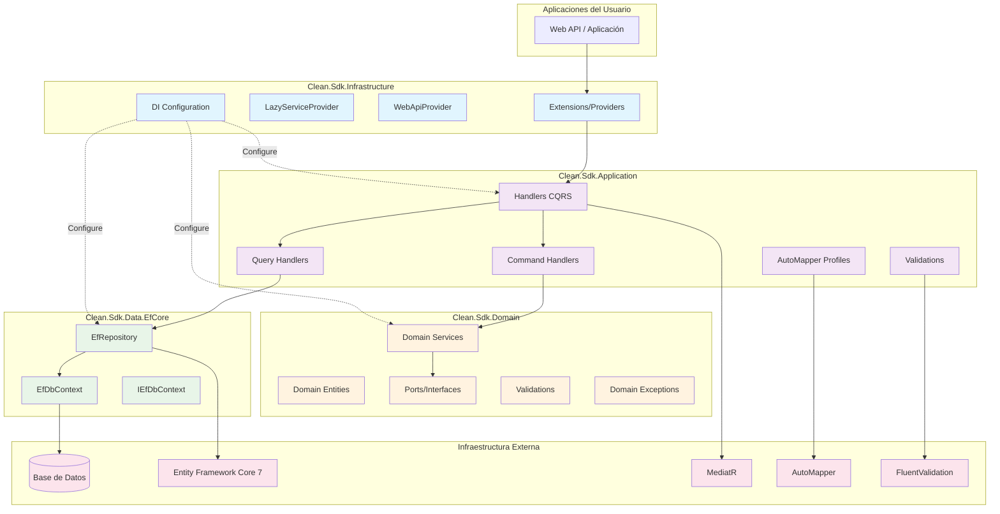
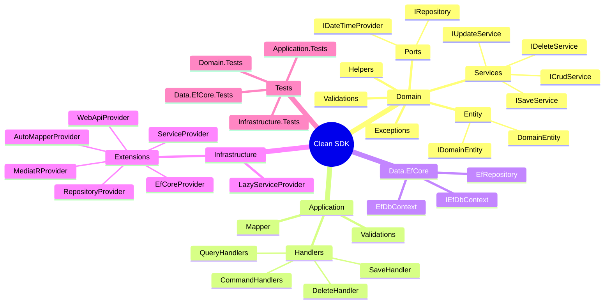
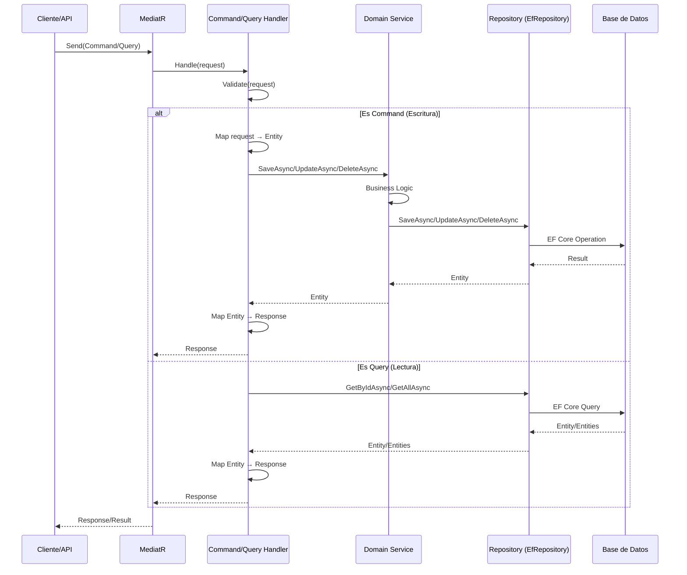

# Arquitectura del Sistema - GPS Principal

Este documento sirve como **GPS arquitectónico** para navegar el framework Clean SDK y guiar el desarrollo de aplicaciones basadas en arquitectura limpia/hexagonal.

## 🎯 **Visión General del Sistema**

### Propósito Principal

**Clean SDK** es un framework .NET diseñado para acelerar el desarrollo de aplicaciones empresariales utilizando principios de **Arquitectura Limpia (Clean Architecture)** y **Arquitectura Hexagonal**. 

El framework proporciona:
- Abstracciones y componentes base para implementar capas de dominio, aplicación, datos e infraestructura
- Implementación de patrones CQRS (Command Query Responsibility Segregation) con MediatR
- **Implementación opcional** de repositorios con Entity Framework Core (Clean.Sdk.Data.EfCore)
- Sistema de validaciones con FluentValidation
- Mapeo automático con AutoMapper
- Inyección de dependencias y bootstrapping simplificado
- **Flexibilidad** para usar otros ORMs o estrategias de persistencia implementando `IRepository<TEntity>`

### Distribución del Ecosistema

- **Total de paquetes identificados**: 4 paquetes principales + 4 paquetes de tests
- **Organización**: Por capas de arquitectura hexagonal
- **Paquetes críticos**: 
  1. `Clean.Sdk.Domain` - Núcleo del dominio (obligatorio)
  2. `Clean.Sdk.Application` - Lógica de aplicación con CQRS (obligatorio)
  3. `Clean.Sdk.Data.EfCore` - Implementación de persistencia con EF Core (**opcional**)
  4. `Clean.Sdk.Infrastructure` - Configuración e integración (obligatorio)

### Diagrama de Arquitectura de Alto Nivel



## 🗂️ **Mapa de Paquetes por Capa Arquitectónica**

### Clean.Sdk.Domain (Capa de Dominio - Núcleo)

- **Función**: Define el núcleo del negocio, entidades de dominio, interfaces (ports) y servicios de dominio
- **Stack principal**: .NET Standard 2.1
- **Dependencias**: Microsoft.Extensions.Logging.Abstractions (7.0.1)
- **Estado**: ✅ Núcleo estable, base para todos los demás paquetes
- **Estructura**:
  - `Entity/` - Entidades base del dominio (`DomainEntity<TId>`, `IDomainEntity`)
  - `Ports/` - Interfaces/contratos (`IRepository`, `IDateTimeProvider`)
  - `Services/` - Interfaces de servicios de dominio (`ISaveService`, `IDeleteService`, `IUpdateService`)
  - `Exceptions/` - Excepciones del dominio
  - `Validations/` - Validaciones y extensiones de validación
  - `Helpers/` - Utilidades auxiliares
  - `Options/` - Configuraciones
  - `Resources/` - Recursos localizables

### Clean.Sdk.Application (Capa de Aplicación - CQRS)

- **Función**: Implementa patrones CQRS con handlers genéricos para comandos y queries
- **Stack principal**: .NET Standard 2.1
- **Dependencias**: 
  - MediatR (12.1.1) - Patrón mediator para CQRS
  - AutoMapper (12.0.1) - Mapeo objeto-objeto
  - FluentValidation (11.9.0) - Validaciones fluidas
- **Estado**: ✅ Implementación completa de CQRS
- **Estructura**:
  - `Handlers/` - Handlers abstractos genéricos:
    - `SaveHandler<TRequest, TResponse, TEntity, TService>` - Manejo de operaciones de guardado
    - `CommandDeleteByIdHandler<TRequest, TEntity, TService>` - Eliminación por ID
    - `QueryByIdHandler<TRequest, TResponse, TEntity, TRepository>` - Consulta por ID
    - `QueryCollectionHandler<TRequest, TResponse, TEntity, TRepository>` - Consulta de colecciones
    - `CommandHandler<TService>` - Base para comandos
    - `QueryHandler<TRepository>` - Base para queries
  - `Validations/` - Reglas y extensiones de validación
  - `Mapper/` - Perfiles de AutoMapper

### Clean.Sdk.Data.EfCore (Capa de Datos - Persistencia) ⚡ **OPCIONAL**

- **Función**: Implementación **opcional** del patrón Repository específicamente para proyectos que usan Entity Framework Core
- **Stack principal**: .NET 6.0
- **Dependencias**:
  - Entity Framework Core (7.0.11)
  - Entity Framework Core Relational (7.0.11)
- **Estado**: ✅ Implementación genérica de repositorio con EF Core (adaptador para EF Core)
- **Uso**: Solo instalar este paquete si tu proyecto usa Entity Framework Core para persistencia
- **Alternativas**: Puedes implementar tu propia versión de `IRepository<TEntity>` con otros ORMs (Dapper, NHibernate, etc.) o acceso directo a datos
- **Componentes clave**:
  - `EfRepository<TEntity, TContext>` - Repositorio genérico con operaciones CRUD sobre EF Core
  - `IEfDbContext` - Interfaz de contexto de base de datos
  - `EfDbContext` - Implementación base del contexto

### Clean.Sdk.Infrastructure (Capa de Infraestructura - Bootstrapping)

- **Función**: Configuración, integración y registro de servicios en contenedor de DI
- **Stack principal**: .NET 6.0
- **Dependencias**:
  - AutoMapper.Extensions.Microsoft.DependencyInjection (12.0.1)
  - Microsoft.AspNetCore.Authentication.JwtBearer (6.0.26)
  - Entity Framework Core para SQL Server (7.0.11)
  - Entity Framework Core para MySQL (8.0.0)
  - Entity Framework Core para PostgreSQL (7.0.11)
  - Entity Framework Core InMemory (7.0.11) - para testing
  - Microsoft.Extensions.Configuration (7.0.0)
- **Estado**: ✅ Bootstrapping y configuración multiplataforma
- **Estructura**:
  - `Extensions/` - Providers de configuración:
    - `ServiceProvider` - Registro automático de servicios de dominio
    - `MediatRProvider` - Configuración de MediatR
    - `AutoMapperProvider` - Configuración de AutoMapper
    - `EfCoreProvider` - Configuración de EF Core
    - `RepositoryProvider` - Registro de repositorios
    - `LazyProvider` - Soporte para Lazy<T>
    - `WebApiProvider` - Configuración de Web API
    - `OptionsProvider` - Configuración de opciones
  - `Utilities/` - Utilidades de infraestructura
  - `LazyServiceProvider.cs` - Proveedor de dependencias lazy

### Mapa Visual de Paquetes



## ⚙️ **Stack Tecnológico Global**

### Tecnologías Principales Identificadas

- **Lenguajes**: C# (.NET Standard 2.1 / .NET 6.0)
- **Frameworks**: 
  - ASP.NET Core 6.0 (para Web APIs)
  - Entity Framework Core 7.0.11 (ORM)
- **Bases de datos soportadas**: 
  - SQL Server
  - MySQL
  - PostgreSQL
  - InMemory (para testing)
- **Herramientas de build**: 
  - MSBuild
  - Azure Pipelines (CI/CD)
- **Testing**: 
  - xUnit (2.4.2)
  - Moq (4.20.70)
  - coverlet (3.2.0) - cobertura de código

### Patrones Arquitectónicos Implementados

1. **Clean Architecture / Arquitectura Hexagonal**: 
   - Separación clara entre capas
   - Dependencias apuntan hacia el dominio
   - Domain es independiente de frameworks externos

2. **CQRS (Command Query Responsibility Segregation)**: 
   - Separación de comandos (escritura) y queries (lectura)
   - Implementado con MediatR
   - Handlers genéricos abstraídos en `Clean.Sdk.Application`

3. **Repository Pattern**: 
   - Abstracción de acceso a datos definida en Domain (`IRepository<TEntity>`)
   - `EfRepository<TEntity, TContext>` en Data.EfCore es **una implementación opcional** (adapter para EF Core)
   - **Puedes crear tu propia implementación** con otros ORMs (Dapper, NHibernate, etc.)

4. **Dependency Injection**: 
   - Uso de `Microsoft.Extensions.DependencyInjection`
   - Providers automáticos en Infrastructure
   - Soporte para Lazy<T> dependencies

5. **Domain-Driven Design (DDD)**: 
   - Entidades de dominio ricas
   - Servicios de dominio
   - Excepciones específicas del dominio
   - Validaciones en el dominio

6. **Generic Programming**: 
   - Handlers genéricos y reutilizables
   - Repositorios genéricos
   - Reducción de código boilerplate

## 🔗 **Puntos de Integración Críticos**

### Dependencias Entre Paquetes

```
┌──────────────────────────────────────┐
│      Clean.Sdk.Infrastructure        │
│  (Orquesta toda la configuración)    │
└──────────────────────────────────────┘
         ↓         ↓         ↓
    ┌────────┐  ┌──────────┐  ┌─────────────┐
    │ Domain │  │Application│  │ Data.EfCore │
    └────────┘  └──────────┘  └─────────────┘
         ↑          ↑               ↑
         └──────────┴───────────────┘
           Todos dependen de Domain
```

**Orden de dependencias (de menor a mayor nivel):**

1. **Clean.Sdk.Domain** - No depende de ningún otro paquete del SDK (define `IRepository<TEntity>`)
2. **Clean.Sdk.Data.EfCore** - Depende de Domain (**opcional** - implementa `IRepository` para EF Core)
3. **Clean.Sdk.Application** - Depende de Domain (usa `IRepository` abstracción)
4. **Clean.Sdk.Infrastructure** - Depende de Domain, Application y opcionalmente Data.EfCore

**Nota importante**: Clean.Sdk.Data.EfCore es **opcional**. Puedes implementar `IRepository<TEntity>` con:
- Dapper
- NHibernate  
- ADO.NET directo
- Cualquier otra estrategia de acceso a datos

### Integraciones con Librerías Externas

| Librería            | Versión  | Usado En            | Propósito                        |
| ------------------- | -------- | ------------------- | -------------------------------- |
| MediatR             | 12.1.1   | Application         | Patrón mediator para CQRS        |
| AutoMapper          | 12.0.1   | Application         | Mapeo DTO ↔ Entidad              |
| FluentValidation    | 11.9.0   | Application         | Validaciones fluidas             |
| EF Core             | 7.0.11   | Data.EfCore         | ORM para acceso a datos          |
| EF Core SQL Server  | 7.0.11   | Infrastructure      | Provider para SQL Server         |
| EF Core MySQL       | 8.0.0    | Infrastructure      | Provider para MySQL              |
| EF Core PostgreSQL  | 7.0.11   | Infrastructure      | Provider para PostgreSQL         |
| EF Core InMemory    | 7.0.11   | Infrastructure      | Base de datos en memoria (tests) |
| JWT Bearer          | 6.0.26   | Infrastructure      | Autenticación con JWT            |
| Microsoft.Extensions| 7.0.x    | Domain/Infrastructure | Logging, Config, DI             |

### Flujo de Datos Típico



## 🔐 **Patrones de Integración y Seguridad**

### Registro de Componentes en DI

El framework utiliza un sistema de registro automático basado en convenciones:

1. **Servicios de Dominio**: 
   - Se registran automáticamente con `AddDomainServices(assembly)`
   - Deben tener un atributo `[Service]`
   - Se busca una interfaz con nombre `I{NombreDelServicio}`

2. **Handlers de MediatR**:
   - Se registran automáticamente con `AddMediatR(assembly)`
   - Escanea el assembly buscando implementaciones de `IRequestHandler<,>`

3. **Perfiles de AutoMapper**:
   - Se registran automáticamente con `AddAutoMapper(assembly)`
   - Detecta clases que heredan de `Profile`

4. **Repositorios**:
   - Se registran manualmente o con `AddRepository<TEntity, TRepository>()`

### Validaciones y Manejo de Errores

1. **Validaciones en Application Layer**:
   - Uso de FluentValidation
   - `AbstractValidator<TRequest>` en cada handler
   - Validación automática antes de ejecutar lógica de negocio
   - `ValidationSet` para organizar reglas

2. **Excepciones del Dominio**:
   - `DomainException` - Base para excepciones de dominio
   - `NotFoundException` - Entidad no encontrada
   - `ValidationSetException` - Errores de validación
   - `AppException` - Excepciones de aplicación

### Autenticación (Opcional)

El paquete Infrastructure incluye soporte para:
- **JWT Bearer Authentication** (6.0.26)
- Configuración a través de `WebApiProvider`

## 🧪 **Realidad de Testing Actual**

### Cobertura por Módulo

- **Clean.Sdk.Domain.Tests**: ✅ Testing de entidades, validaciones y servicios de dominio
- **Clean.Sdk.Application.Tests**: ✅ Testing de handlers con Moq
- **Clean.Sdk.Data.EfCore.Tests**: ✅ Testing de repositorios con EF Core InMemory
- **Clean.Sdk.Infrastructure.Tests**: ✅ Testing de configuración y providers

### Stack de Testing

| Herramienta     | Versión | Propósito                        |
| --------------- | ------- | -------------------------------- |
| xUnit           | 2.4.2   | Framework de testing             |
| Moq             | 4.20.70 | Mocking de dependencias          |
| coverlet        | 3.2.0   | Cobertura de código              |
| EF Core InMemory| 7.0.11  | Base de datos en memoria (tests) |

### Comandos de Testing Identificados

```bash
# Ejecutar todos los tests de la solución
dotnet test Clean.Skd.sln

# Ejecutar tests de un proyecto específico
dotnet test Clean.Sdk.Domain.Tests/Clean.Sdk.Domain.Tests.csproj
dotnet test Clean.Sdk.Application.Tests/Clean.Sdk.Application.Tests.csproj
dotnet test Clean.Sdk.Data.EfCore.Tests/Clean.Sdk.Data.EfCore.Tests.csproj
dotnet test Clean.Sdk.Infrastructure.Tests/Clean.Sdk.Infrastructure.Tests.csproj

# Ejecutar tests con cobertura
dotnet test /p:CollectCoverage=true
```

### Estrategia de Testing

1. **Tests Unitarios**: Todas las capas tienen tests unitarios
2. **Mocking**: Uso de Moq para dependencias externas
3. **InMemory DB**: EF Core InMemory para tests de repositorio
4. **Builders de Datos**: Uso de DataBuilders en Application.Tests

## ⚠️ **Deuda Técnica y Observaciones**

### Observaciones del Análisis

1. **README Mínimo**: El README.md solo contiene el título "Gbso.Clean", sin documentación de uso
2. **Typo en Nombre de Archivo**: `Clean.Skd.sln` debería ser `Clean.Sdk.sln`
3. **Archivo de Pipeline Typo**: `Clean.Sdk.Generci-CD.yml` tiene typo ("Generci" → "Generic")
4. **Proyectos Legacy**: Existen proyectos `Clean.Application`, `Clean.Domain`, etc. (sin "Sdk" en el nombre) que parecen ser versiones antiguas

### Configuraciones de Build

El framework soporta 3 configuraciones de build:
- **Debug**: Referencias a proyectos locales
- **Prerelease**: Referencias a paquetes NuGet pre-release (`*-*`)
- **Release**: Referencias a paquetes NuGet estables (`*`)

### Versiones de .NET

- **Domain & Application**: .NET Standard 2.1 (máxima compatibilidad)
- **Data.EfCore & Infrastructure**: .NET 6.0 (características modernas)

## 📦 **Dependencias Externas Críticas**

### Análisis de Riesgo de Dependencias

| Dependencia               | Versión Actual | Última Versión | Riesgo   | Notas                                       |
| ------------------------- | -------------- | -------------- | -------- | ------------------------------------------- |
| MediatR                   | 12.1.1         | 12.x           | 🟢 Bajo  | Versión actual                              |
| AutoMapper                | 12.0.1         | 12.x           | 🟢 Bajo  | Versión actual                              |
| FluentValidation          | 11.9.0         | 11.x           | 🟢 Bajo  | Versión estable                             |
| Entity Framework Core     | 7.0.11         | 8.0.x          | 🟡 Medio | EF Core 8 disponible (.NET 8)               |
| JWT Bearer                | 6.0.26         | 8.0.x          | 🟡 Medio | Actualización a .NET 8 recomendada          |
| Microsoft.Extensions      | 7.0.x          | 8.0.x          | 🟡 Medio | Versiones de .NET 8 disponibles             |
| xUnit                     | 2.4.2          | 2.6.x          | 🟢 Bajo  | Actualización menor disponible              |
| Moq                       | 4.20.70        | 4.20.x         | 🟢 Bajo  | Versión reciente                            |

### Dependencias Críticas para el Framework

**Bibliotecas Core:**
- **MediatR** - Esencial para el patrón CQRS
- **Entity Framework Core** - Base para persistencia
- **AutoMapper** - Mapeo de objetos
- **FluentValidation** - Sistema de validaciones

**Providers de Base de Datos:**
- **SQL Server** - Microsoft.EntityFrameworkCore.SqlServer
- **MySQL** - MySql.EntityFrameworkCore
- **PostgreSQL** - Npgsql.EntityFrameworkCore.PostgreSQL

## 🔧 **Comandos de Desarrollo Esenciales**

### Setup Inicial

```powershell
# Clonar el repositorio
git clone https://github.com/GbsoDev/Clean.git
cd Clean/repositorio

# Restaurar dependencias NuGet
dotnet restore Clean.Skd.sln

# Build completo de la solución
dotnet build Clean.Skd.sln
```

### Desarrollo Diario

```powershell
# Build de un proyecto específico
dotnet build Clean.Sdk.Domain/Clean.Sdk.Domain.csproj
dotnet build Clean.Sdk.Application/Clean.Sdk.Application.csproj

# Build en configuración específica
dotnet build Clean.Skd.sln -c Debug
dotnet build Clean.Skd.sln -c Prerelease
dotnet build Clean.Skd.sln -c Release

# Ejecutar tests
dotnet test Clean.Skd.sln

# Ejecutar tests con cobertura
dotnet test Clean.Skd.sln /p:CollectCoverage=true

# Limpiar artifacts
dotnet clean Clean.Skd.sln
```

### Empaquetado y Publicación

```powershell
# Empaquetar para NuGet (Debug - desarrollo local)
dotnet pack Clean.Sdk.Domain/Clean.Sdk.Domain.csproj -c Debug

# Empaquetar para NuGet (Prerelease)
dotnet pack Clean.Sdk.Domain/Clean.Sdk.Domain.csproj -c Prerelease

# Empaquetar para NuGet (Release)
dotnet pack Clean.Sdk.Domain/Clean.Sdk.Domain.csproj -c Release

# Publicar a feed de NuGet
dotnet nuget push *.nupkg --source <nuget-feed-url> --api-key <api-key>
```

### CI/CD con Azure Pipelines

El framework utiliza Azure Pipelines con dos tipos de pipelines:

1. **CI Pipeline** (`Clean.Sdk-CI.yml`):
   - Se dispara en push/PR a branches: `main`, `release`, `dev`
   - Ejecuta build y tests de todos los proyectos
   - Orden de ejecución:
     1. Domain → Tests
     2. Data.EfCore → Tests (depende de Domain)
     3. Application → Tests (depende de Domain)
     4. Infrastructure → Tests (depende de Application)

2. **CD Pipelines** (archivos `*-CD.yml`):
   - Pipelines individuales por paquete
   - Para publicación a NuGet

## 📋 **Guía Rápida para Desarrollo de Aplicaciones**

### Cómo Usar el Framework

Para crear una aplicación usando Clean SDK, sigue estos pasos:

#### 1. Instalar los Paquetes NuGet

```powershell
# Paquetes obligatorios
dotnet add package Clean.Sdk.Domain
dotnet add package Clean.Sdk.Application
dotnet add package Clean.Sdk.Infrastructure

# Paquete OPCIONAL - Solo si usas Entity Framework Core
dotnet add package Clean.Sdk.Data.EfCore

# Si usas otro ORM (ej: Dapper), NO instales Clean.Sdk.Data.EfCore
# En su lugar, implementa tu propio IRepository<TEntity>
```

#### 2. Definir Entidades de Dominio

```csharp
using Clean.Sdk.Domain.Entity;

public class Product : DomainEntity<int>
{
    public string Name { get; set; }
    public decimal Price { get; set; }
}
```

#### 3. Crear Servicios de Dominio

```csharp
using Clean.Sdk.Domain.Services;

public interface IProductService : ISaveService<Product>, IDeleteService<Product>
{
    // Métodos adicionales específicos del negocio
}

[Service]
public class ProductService : IProductService
{
    private readonly IRepository<Product> _repository;
    
    public ProductService(IRepository<Product> repository)
    {
        _repository = repository;
    }
    
    // Implementación...
}
```

#### 4. Crear Comandos y Queries

```csharp
using MediatR;

// Comando para crear producto
public class CreateProductCommand : IRequest<ProductResponse>
{
    public string Name { get; set; }
    public decimal Price { get; set; }
}

// Query para obtener producto por ID
public class GetProductByIdQuery : QueryById<int, ProductResponse>
{
    public GetProductByIdQuery(int id) : base(id) { }
}
```

#### 5. Crear Handlers

```csharp
using Clean.Sdk.Application.Handlers;

public class CreateProductHandler : SaveHandler<CreateProductCommand, ProductResponse, Product, IProductService>
{
    public CreateProductHandler(
        ILogger<Handler> logger, 
        IMapper mapper, 
        Lazy<IProductService> service) 
        : base(logger, mapper, service)
    {
    }
    
    protected override AbstractValidator<CreateProductCommand>? ValidationRules => new CreateProductValidator();
}
```

#### 6. Configurar en Startup/Program.cs

**Opción A: Usando Entity Framework Core (con Clean.Sdk.Data.EfCore)**

```csharp
var builder = WebApplication.CreateBuilder(args);

// Configurar servicios del framework con EF Core
builder.Services
    .AddMediatR(typeof(CreateProductHandler).Assembly)
    .AddAutoMapper(typeof(CreateProductHandler).Assembly)
    .AddDomainServices(typeof(ProductService).Assembly)
    .AddDbContext<MyDbContext>()
    .AddScoped<IRepository<Product>, EfRepository<Product, MyDbContext>>();

var app = builder.Build();
// ...
```

**Opción B: Usando otro ORM (ej: Dapper, sin Clean.Sdk.Data.EfCore)**

```csharp
var builder = WebApplication.CreateBuilder(args);

// Configurar servicios del framework con implementación personalizada
builder.Services
    .AddMediatR(typeof(CreateProductHandler).Assembly)
    .AddAutoMapper(typeof(CreateProductHandler).Assembly)
    .AddDomainServices(typeof(ProductService).Assembly)
    // Registrar tu propia implementación de IRepository
    .AddScoped<IRepository<Product>, DapperProductRepository>();

var app = builder.Build();
// ...
```

## 📋 **Archivos de Referencia Rápida**

### Estructura de la Solución

```
repositorio/
├── Clean.Sdk.Domain/              # Núcleo del dominio
├── Clean.Sdk.Application/         # Handlers CQRS
├── Clean.Sdk.Data.EfCore/         # Repositorios EF Core
├── Clean.Sdk.Infrastructure/      # Configuración y DI
├── Clean.Sdk.Domain.Tests/        # Tests de dominio
├── Clean.Sdk.Application.Tests/   # Tests de aplicación
├── Clean.Sdk.Data.EfCore.Tests/   # Tests de datos
├── Clean.Sdk.Infrastructure.Tests/# Tests de infraestructura
├── Clean.Skd.sln                  # Solución principal
└── Clean.Sdk-CI.yml               # Pipeline de CI
```

### Documentación Existente Encontrada

- **README.md**: Documentación mínima (solo título)
- **LICENSE**: Archivo de licencia del proyecto

### Configuraciones Importantes

- **Clean.Skd.sln**: Solución principal con todos los proyectos
- **\*.csproj**: Archivos de proyecto con dependencias y configuración
- **Clean.Sdk-CI.yml**: Configuración de integración continua
- **Clean.Sdk-\*-CD.yml**: Configuración de despliegue continuo por paquete

## 🎯 **Próximos Pasos de Documentación**

Este GPS inicial debe complementarse con documentación detallada:

- [ ] **README.md completo** - Guía de inicio rápido, ejemplos de uso, instalación
- [ ] **Guías de uso por capa** - Documentación detallada de Domain, Application, Data, Infrastructure
- [ ] **Ejemplos de implementación** - Aplicaciones de ejemplo completas
- [ ] **Guía de contribución** - Estándares de código, proceso de PR
- [ ] **Documentación de APIs** - XML comments en código público
- [ ] **Tutoriales paso a paso** - Creación de una aplicación desde cero
- [ ] **Guía de migración** - Migrar de proyectos legacy a Clean SDK
- [ ] **Documentación de testing** - Estrategias y mejores prácticas
- [ ] **Guía de troubleshooting** - Problemas comunes y soluciones
- [ ] **Changelog y versioning** - Historial de cambios entre versiones

---

## 📌 **Resumen Ejecutivo**

**Clean SDK** es un framework .NET modular y bien estructurado que implementa arquitectura limpia con los siguientes pilares:

1. ✅ **Separación clara de capas** - Domain → Application → Data → Infrastructure
2. ✅ **Patrones probados** - CQRS, Repository, DI, DDD
3. ✅ **Testing comprehensivo** - Tests unitarios en todas las capas
4. ✅ **Multiplataforma** - Soporte para SQL Server, MySQL, PostgreSQL (via EF Core)
5. ✅ **Extensible** - Handlers y repositorios genéricos reutilizables
6. ✅ **Flexible** - Data.EfCore es opcional, puedes usar cualquier estrategia de persistencia
7. ✅ **CI/CD automatizado** - Azure Pipelines configurado
8. ⚠️ **Documentación mejorable** - README mínimo, falta documentación de uso

**Audiencia objetivo**: Desarrolladores .NET que buscan acelerar el desarrollo de aplicaciones empresariales siguiendo clean architecture.

**Flexibilidad de persistencia**: El framework define la abstracción `IRepository<TEntity>` en Domain. Clean.Sdk.Data.EfCore es solo **una implementación opcional** para Entity Framework Core. Puedes implementar tu propia versión con Dapper, NHibernate, ADO.NET, o cualquier otra tecnología.

---

*Documento generado por Arquitecto Ceiba - Método Ceiba v2.0*
*Fecha: 16 de Octubre de 2025*
