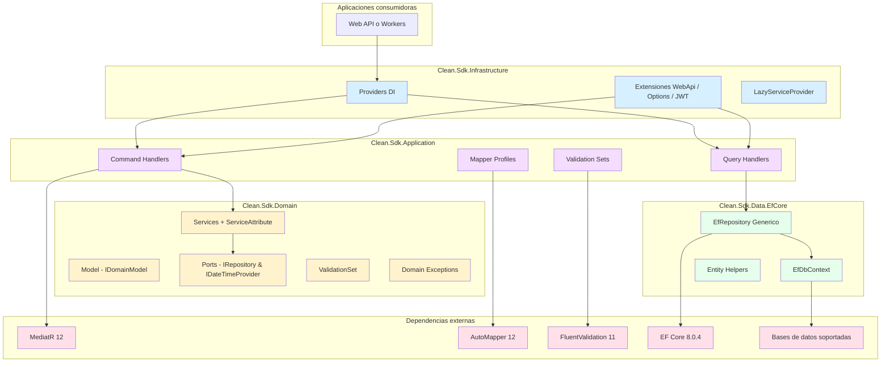
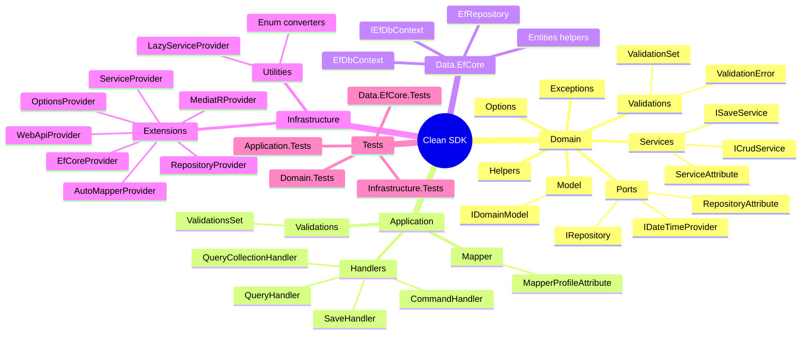
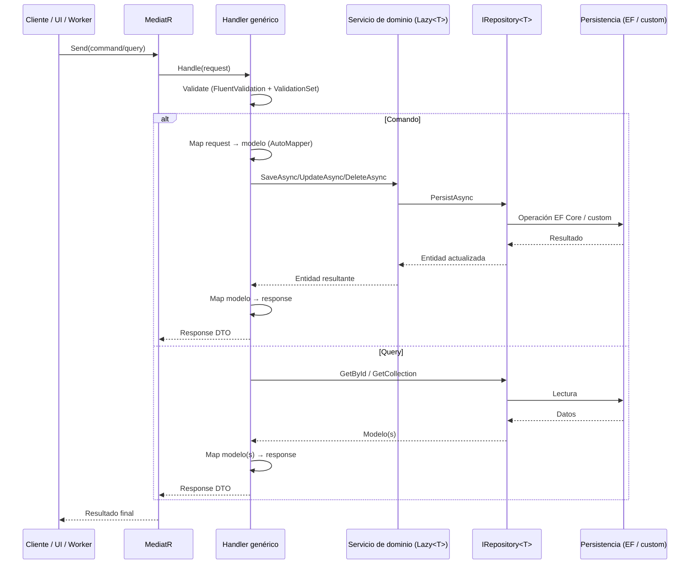

# Arquitectura del Sistema - GPS Principal

Este documento es el **GPS arquitectónico** de Clean SDK: un conjunto de paquetes .NET 8 que encapsulan patrones de arquitectura limpia/hexagonal para acelerar la construcción de aplicaciones empresariales.

## 🎯 Visión general del sistema

### Propósito principal

Clean SDK ofrece un **núcleo de building blocks reutilizables** para soluciones basadas en Clean Architecture y CQRS:

- Define contratos de dominio (`IDomainModel`, `IRepository`, servicios genéricos) y utilidades transversales.
- Brinda handlers genéricos de comandos y consultas con MediatR + AutoMapper + FluentValidation.
- Incluye una implementación opcional de persistencia con Entity Framework Core 8.
- Centraliza bootstrapping e integración mediante extensiones de infraestructura para DI, opciones, autenticación y proveedores de datos.

### Distribución del ecosistema

- **Paquetes productivos**: 4 (`Clean.Sdk.Domain`, `Clean.Sdk.Application`, `Clean.Sdk.Data.EfCore`, `Clean.Sdk.Infrastructure`).
- **Paquetes de pruebas**: 4 (`*.Tests`) alineados con cada capa.
- **Stack objetivo**: `.NET 8` para todas las bibliotecas y suites de test.
- **Paquetes críticos**:
  1. `Clean.Sdk.Domain` – núcleo obligatorio y punto de convergencia de dependencias.
  2. `Clean.Sdk.Application` – capa CQRS que orquesta servicios de dominio y repositorios.
  3. `Clean.Sdk.Data.EfCore` – adaptador de repositorio sobre EF Core 8 (instalable solo cuando se requiere EF).
  4. `Clean.Sdk.Infrastructure` – punto de armado: proveedores DI, autenticación, data providers y utilidades.

### Diagrama de arquitectura de alto nivel



*Supuesto: al no existir referencias explícitas a integraciones SaaS externas dentro de Clean.Sdk, se documenta únicamente la interacción con dependencias NuGet y bases de datos configurables. Actualizar esta sección cuando existan proveedores externos formales en la solución que consuma el SDK.*

## 🗂️ Mapa de paquetes por capa

### Clean.Sdk.Domain – Núcleo del dominio

- **Función**: Encapsula contratos, servicios y utilidades transversales independientes del framework.
- **Target**: `net8.0`.
- **Dependencias NuGet**: `Microsoft.Extensions.Logging.Abstractions` 8.0.0.
- **Estructura destacada**:
  - `Model/IDomainModel.cs`: contrato común para modelos con `Id` fuertemente tipado.
  - `Ports/`: `IRepository<TModel>`, `IDateTimeProvider`, `RepositoryAttribute`.
  - `Services/`: servicios genéricos (`ISaveService`, `IDeleteService`, `IUpdateService`, `ICrudService`) y clases base (`Service`, `CrudService`). El atributo `[Service]` habilita descubrimiento automático.
  - `Exceptions/`: jerarquía (`AppExeption`, `ValidationException`, `NotAuthorizeException`, etc.).
  - `Validations/`: `ValidationSet`, extensiones de argumento y excepciones asociadas.
  - `Helpers/`: utilidades de reflexión (`AssemblyHelper`, `InterfaceHelper`), hashing y enums.
  - `Options/`: mapeo de configuración (`AppSettings`, `AuthOptions`, `OptionAttribute`).

### Clean.Sdk.Application – Capa CQRS

- **Función**: Provee handlers genéricos de comandos/consultas/actualizaciones basados en MediatR.
- **Target**: `net8.0`.
- **Dependencias**: `MediatR` 12.1.1, `AutoMapper` 12.0.1, `FluentValidation` 11.9.0, `Microsoft.Extensions.DependencyInjection.Abstractions` 8.0.0.
- **Componentes clave**:
  - `Handlers/`:
    - `Handler` → base común.
    - `CommandHandler<TService>` y `QueryHandler<TRepository>` → manejo de dependencias diferido (`Lazy<T>`).
    - `SaveHandler`, `UpdateHandler`, `CommandDeleteByIdHandler`, `QueryByIdHandler`, `QueryCollectionHandler` → implementación genérica con mapeo `IMapper` y validaciones.
    - Interfaz/atributo `AplicacionHandlerAttribute` para convenciones.
  - `Validations/ValidationsSet.cs`: convención de rule sets (`ValidationsSet.SAVE`, `UPDATE`, etc.).
  - `Mapper/MapperProfileAttribute.cs`: atributo para descubrimiento automatizado de perfiles AutoMapper.

### Clean.Sdk.Data.EfCore – Persistencia opcional

- **Función**: Adapta `IRepository<TModel>` a Entity Framework Core 8.
- **Target**: `net8.0`.
- **Dependencias**: `Microsoft.EntityFrameworkCore` 8.0.4, `Microsoft.EntityFrameworkCore.Relational` 8.0.4, `AutoMapper` 12.0.1.
- **Estructura**:
  - `EfRepository<TEntity, TContext>`: CRUD genérico con soporte para expressiones, carga de relaciones y paginación básica.
  - `EfDbContext` / `IEfDbContext`: contrato base de contexto (inyectable en consumers).
  - `Entities/`: helpers de entidades (`IDomainEntity`, `IAuditableEntity`, `EntityHelper`).
- **Configuraciones**: En `Debug` referencia el proyecto Domain para desarrollo local; en `Prerelease/Release` espera consumir paquetes `Clean.Sdk.Domain` publicados desde un feed NuGet.

### Clean.Sdk.Infrastructure – Bootstrapping & Integración

- **Función**: Centraliza extensiones para registrar servicios del SDK en la aplicación final.
- **Target**: `net8.0`.
- **Dependencias** (selección):
  - `AutoMapper.Extensions.Microsoft.DependencyInjection` 12.0.1.
  - `Microsoft.AspNetCore.Authentication.JwtBearer` 8.0.0.
  - Proveedores EF Core 8.0.4 para SQL Server, InMemory, PostgreSQL y `MySql.EntityFrameworkCore` 8.0.0.
  - `Microsoft.Extensions.Configuration.*` 8.0.0.
- **Extensiones principales** (`Extensions/`):
  - `ServiceProvider`: registra clases con `[Service]` y su interfaz `I{Nombre}`; lanza `AppExeption` cuando la interfaz no existe.
  - `RepositoryProvider`: registra clases con `[Repository]` con la misma convención `I{Nombre}`.
  - `MediatRProvider`, `AutoMapperProvider`, `EfCoreProvider`, `OptionsProvider`, `WebApiProvider`, `LazyProvider`.
- **Utilidades**: `LazyServiceProvider` para inyección diferida, convertidores de enums (`Utilities/`).

### Visualización general de paquetes



## ⚙️ Stack tecnológico global

- **Lenguaje**: C# 12 sobre .NET 8.
- **Frameworks/Libs**: MediatR 12.1.1, AutoMapper 12.0.1, FluentValidation 11.9.0, EF Core 8.0.4, JwtBearer 8.0.0.
- **Persistencia soportada**: SQL Server, PostgreSQL, MySQL, InMemory (via providers EF Core 8); otras estrategias mediante implementaciones propias de `IRepository`.
- **Herramientas de build**: `dotnet` (MSBuild), pipelines YAML para CI/CD (`Clean.Sdk-CI.yml`, `Clean.Sdk.*-CD.yml`).
- **Testing**: xUnit 2.6.3, Moq 4.20.70, `coverlet.collector` 6.0.0, `Microsoft.NET.Test.Sdk` 17.10.0.
- **Observación**: Las metadata de los `.csproj` (Title/Description) aún reflejan “Clean Data EfCore” y deben alinearse en un ciclo posterior.

### Patrones arquitectónicos implementados

1. **Arquitectura limpia / hexagonal**: dependencias apuntando al dominio, abstracciones de ports/adapters.
2. **CQRS**: separación explícita de comandos/consultas, handlers genéricos, Mediator pattern (MediatR) en el centro.
3. **Repository pattern**: `IRepository<TModel>` como puerto; adaptadores concretos via EF Core u otros ORMs.
4. **Inversión de control**: DI extendido por convenciones, providers para registrar servicios, repositorios, opciones, AutoMapper y MediatR.
5. **Validaciones declarativas**: FluentValidation + `ValidationsSet` para orquestar pipelines de reglas por escenario.
6. **Domain-driven building blocks**: excepciones, helpers, servicios y opciones de configuración centradas en el dominio.

## 🔗 Puntos de integración internos

```
┌────────────────────────────┐
│ Clean.Sdk.Infrastructure   │
│ (registro & providers)     │
└─────────────┬──────────────┘
              │
    ┌─────────▼─────────┐
    │ Clean.Sdk.Application │────────┐
    └─────────┬─────────┘        │
              │                   │
      ┌───────▼───────┐      ┌────▼────┐
      │ Clean.Sdk.Domain │◀────│ Clean.Sdk.Data.EfCore │
      └────────────────┘      └────────┘
```

- `Clean.Sdk.Domain` no depende de otros proyectos del SDK.
- `Clean.Sdk.Application` y `Clean.Sdk.Data.EfCore` dependen de Domain.
- `Clean.Sdk.Infrastructure` depende de Domain + Application y, en modo Debug, también de Data.EfCore (para escenarios sin paquete publicado).
- Los proyectos `*.Tests` referencian su contraparte productiva y utilizan `Microsoft.EntityFrameworkCore.InMemory` cuando aplica.

### Integraciones con librerías externas

| Librería / Servicio | Versión | Consumo | Propósito |
| --- | --- | --- | --- |
| MediatR | 12.1.1 | Application/Infrastructure | Mediator pattern para CQRS |
| AutoMapper | 12.0.1 | Application/Infrastructure | Mapeo DTO ↔ modelo |
| FluentValidation | 11.9.0 | Application | Reglas declarativas |
| Microsoft.Extensions.* | 8.0.0 | Todas las capas | Logging, configuración, DI |
| EF Core | 8.0.4 | Data.EfCore/Infrastructure | Persistencia relacional |
| JwtBearer | 8.0.0 | Infrastructure | Autenticación JWT opcional |
| `MySql.EntityFrameworkCore` | 8.0.0 | Infrastructure | Provider MySQL |
| `Npgsql.EntityFrameworkCore.PostgreSQL` | 8.0.4 | Infrastructure | Provider PostgreSQL |
| `Microsoft.EntityFrameworkCore.InMemory` | 8.0.4 | Infrastructure/Tests | Tests de repositorios |

No se detectaron integraciones directas con servicios externos (Auth0, Stripe, etc.) dentro del SDK; las aplicaciones consumidoras deben documentar dichos enlaces.

### Flujo de datos típico



## 🔐 Patrones de integración y seguridad

- **Descubrimiento automático**:
  - `AddDomainServices(assembly)` registra clases con `[Service]` y la interfaz `I{Nombre}`; sin interfaz lanza `AppExeption` con mensaje localizado (`Messages.ServiceHasNoInterface`).
  - `AddRepositories(assembly)` replica la convención para `[Repository]`.
  - `AddMediatR`, `AddAutoMapper` y `AddValidators` (mediante scanning) permiten bootstrap sin wiring manual.
- **Autenticación**: `WebApiProvider` incorpora configuración base para JWT Bearer 8.0.0 (debe completarse en la aplicación host).
- **Validaciones**: `ValidationsSet` habilita segmentar reglas por operación (`SAVE`, `UPDATE`, `DELETE`). Las validaciones lanzan `ValidationSetException` con detalles.
- **Errores**: Excepciones custom de dominio facilitan diferenciación de fallos (argumento inválido, no autorizado, no encontrado, nulos, etc.).

## 🧪 Realidad de testing

- **Clean.Sdk.Domain.Tests** (`net8.0`): validaciones, helpers, servicios; recursos `.resx` para mensajes.
- **Clean.Sdk.Application.Tests**: pruebas unitarias de handlers usando Moq; referencia `Clean.Sdk.Domain.Tests` para builders reutilizables.
- **Clean.Sdk.Data.EfCore.Tests**: escenario InMemory con EF Core 8 para validar `EfRepository`.
- **Clean.Sdk.Infrastructure.Tests**: verificación de providers y registros DI.

| Herramienta | Versión | Uso |
| --- | --- | --- |
| xUnit | 2.6.3 | Framework de pruebas |
| Moq | 4.20.70 | Mocking |
| coverlet.collector | 6.0.0 | Cobertura | 
| Microsoft.NET.Test.Sdk | 17.10.0 | Infraestructura de test |

### Comandos útiles

```powershell
# Restaurar dependencias
dotnet restore Clean.Skd.sln

# Build completo (Debug por defecto)
dotnet build Clean.Skd.sln

# Ejecutar todas las pruebas
dotnet test Clean.Skd.sln

# Ejecutar pruebas con cobertura
dotnet test Clean.Skd.sln /p:CollectCoverage=true

# Empaquetar (Release)
dotnet pack Clean.Sdk.Domain/Clean.Sdk.Domain.csproj -c Release
```

> Nota: la solución se llama `Clean.Skd.sln` (typo heredado). Considera renombrarla a `Clean.Sdk.sln` para consistencia.

## ⚠️ Observaciones y deuda técnica

- **Metadatos inconsistentes**: Los `.csproj` de Domain, Application y Data.EfCore mantienen títulos/descripciones heredadas de “Clean Data EfCore”; corregir para reflejar cada capa.
- **Tipografía de archivos**: `Clean.Skd.sln` y `Clean.Sdk.Generci-CD.yml` contienen errores de nombre. Renombrar implica ajustar pipelines/solutions.
- **Documentación mínima**: El `README.md` del repo raíz solo incluye el título; conviene expandirlo con guía rápida.
- **Opcionalidad EF Core**: `Clean.Sdk.Infrastructure` referencia `Clean.Sdk.Data.EfCore` en modo Debug, lo que puede sorprender en escenarios donde se desea excluir EF. Documentar la expectativa (usar configuración Release/Prerelease o empaquetado) o desacoplar en el código.
- **Falta de guía cross-repo**: Este GPS cubre únicamente Clean.Sdk. Las aplicaciones host (p.ej. `finance-dotnet-webapi`) deben documentar cómo consumen el SDK, orquestan autenticación externa, mensajería y pipelines.

## 📦 Dependencias y riesgo

| Dependencia | Versión actual | Última versión | Riesgo | Comentario |
| --- | --- | --- | --- | --- |
| .NET SDK | 8.0.x | 8.0.x | 🟢 Bajo | Al día |
| MediatR | 12.1.1 | 12.x | 🟢 Bajo | Última rama estable |
| AutoMapper | 12.0.1 | 13.x preview | 🟢 Bajo | Versión estable soportada |
| FluentValidation | 11.9.0 | 11.9.x | 🟢 Bajo | Actual |
| EF Core | 8.0.4 | 8.0.x | 🟢 Bajo | Último patch LTS |
| JwtBearer | 8.0.0 | 8.0.x | 🟡 Medio | Revisar patches de seguridad recientes |
| xUnit | 2.6.3 | 2.6.4 | 🟢 Bajo | Actualizable sin breaking |
| coverlet.collector | 6.0.0 | 6.0.x | 🟢 Bajo | Último major |

No se identificaron dependencias con vulnerabilidades CVE abiertas en las versiones fijadas. Mantener monitoreo continuo.

## 🔧 Guía rápida para desarrollo

1. Restaurar y compilar con `dotnet restore` / `dotnet build` sobre `.NET 8`.
2. Ejecutar pruebas unitarias (`dotnet test`) con cobertura opcional.
3. Empaquetar capas individuales (`dotnet pack`) según la configuración (`Debug`, `Prerelease`, `Release`).
4. Publicar a feed NuGet conforme a los pipelines (`Clean.Sdk.*-CD.yml`).
5. Desde una aplicación externa, instalar los paquetes necesarios (`Clean.Sdk.Domain`, `Clean.Sdk.Application`, `Clean.Sdk.Infrastructure` y opcionalmente `Clean.Sdk.Data.EfCore`) y registrar mediante extensiones de Infrastructure.

## 📋 Archivos y referencias clave

- `Clean.Skd.sln`: solución principal (renombrado pendiente).
- `Clean.Sdk-*-CD.yml`: pipelines de publicación por paquete.
- `Clean.Sdk-CI.yml`: pipeline de integración continua.
- `architecture/index.md`: este GPS (actualiza aquí conforme evolucione el stack).
- `LICENSE`: licencia MIT.

## 📌 Próximos pasos sugeridos

- [ ] Ajustar metadata de `.csproj` (Title, Description) a cada capa.
- [ ] Documentar flujo completo de registro DI en una guía dedicada.
- [ ] Generar ejemplos de implementación (quickstart) en el README general.
- [ ] Analizar la posibilidad de desacoplar `Clean.Sdk.Infrastructure` de `Clean.Sdk.Data.EfCore` para escenarios sin EF en Debug.
- [ ] Revisar pipelines para renombrar `Clean.Skd.sln` → `Clean.Sdk.sln` de forma coordinada.
- [ ] Incorporar métricas de cobertura y badges en CI/CD.

---

*Documento actualizado por Arquitecto Ceiba – 18 de octubre de 2025.*
